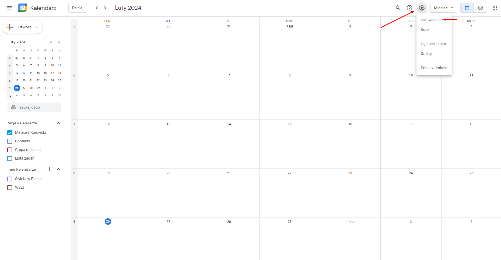
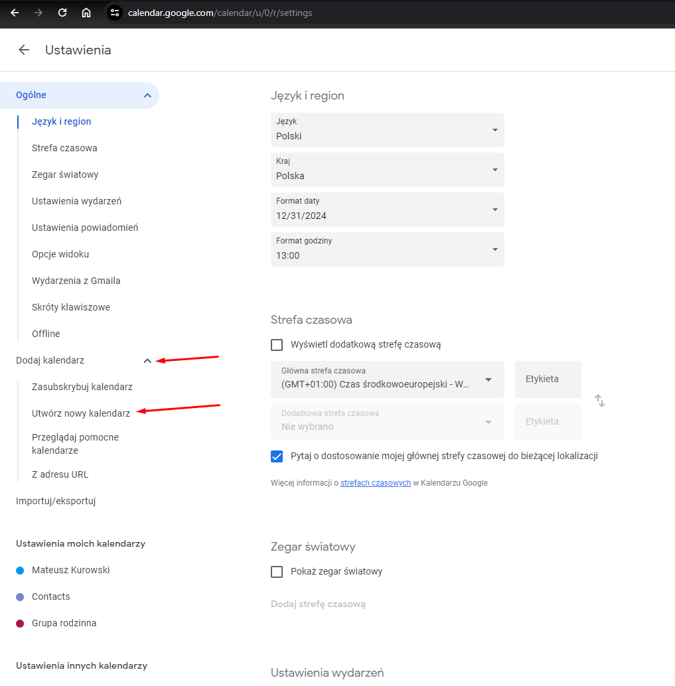
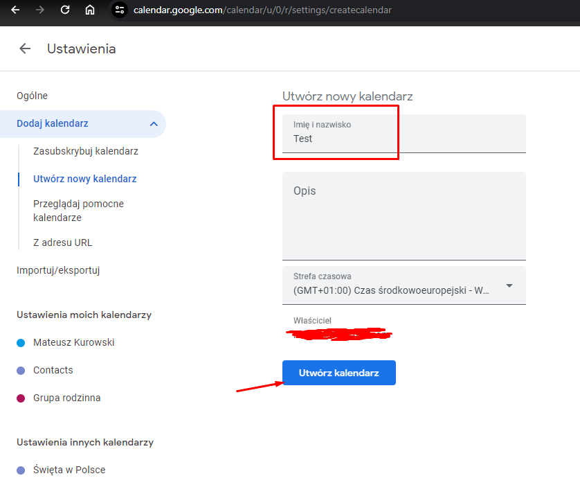
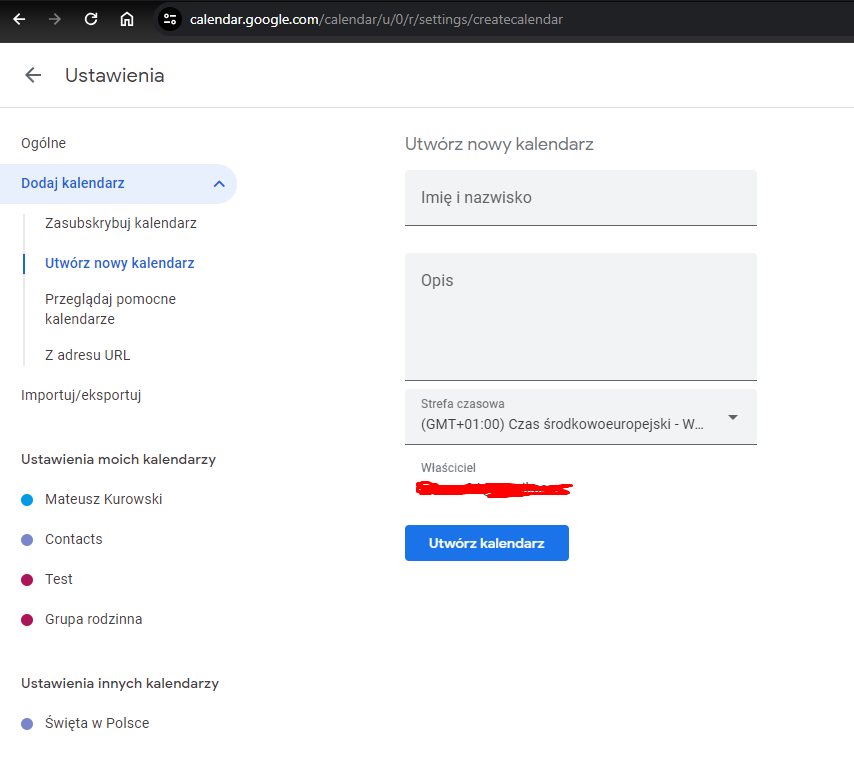
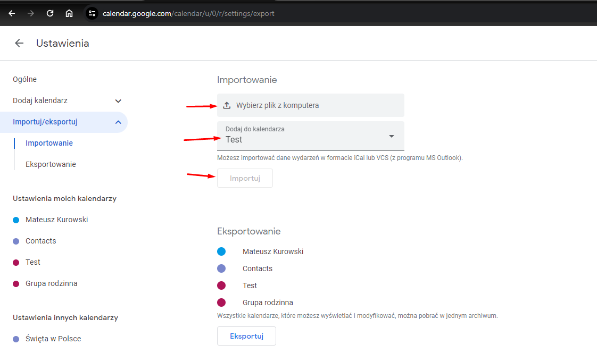

# Giants Schedule

## Description

The project aims to automate the process of retrieving class schedules, allowing for quick and easy import into a chosen calendar. The script retrieves classes for a specified day and semester, saving them to a CSV file that can be easily imported into the chosen calendar.

This is my first project in Puppeteer, I'm not proficient in front-end development, and I'm also a bit clumsy with JavaScript, so any guidance, attempts to improve/enhance are welcome :)

## Instructions

1. **Check Node.js Installation:**

   Make sure Node.js is installed on your computer. You can check this by typing `node -v` in the system console. If a version is returned, Node.js is already installed. Otherwise, download it from the [Node.js official website](https://nodejs.org/en/download/current).

2. **Download the Project:**

   Click on the **<> Code** button, then download the project as a ZIP file or clone the repository using the command `git clone https://github.com/MateuszKurowski/grafik_gigantow.git`.

3. **Install Dependencies:**

   After downloading the project, navigate to its directory in the terminal and run the command `npm install` to install the required dependencies.

4. **Configure the _config.json_ File:**

   Fill in the login credentials and information about the groups in the configuration file _config.json_, completing the fields below the "\_comment" field, which contain descriptions for each field.

5. **Run the Script:**

   After configuring the _config.json_ file, run the script by typing `node start.js` in the system console.

6. **Automated Script Execution:**

   After launching the program and loading the configuration file, a browser will open in the background, automatically conducting the interaction process with the CRM. The browser will not be visible to the user.

After the script finishes running, a file named **_Terminarz giganci.csv_** or **_Terminarz giganci.isc_** will appear in the main folder, depending on the chosen option, which can be imported into the selected calendar.

## Error Verification

If an error occurs, a file named _blad.txt_ will be created in the main folder, containing a detailed description of the error and the line where it occurred. Please review this message. If the problem cannot be resolved, include the _blad.txt_ file when reporting the error.

## Supported Calendars

- [x] Google Calendar

 I haven't checked others, I encourage verification and leaving feedback.

## Example Import to Google Calendar

1. Go to [Google Calendar](https://calendar.google.com/).
2. Open settings by clicking on the gear icon.
   
3. Expand the _Add calendar_ option and select _Create new calendar_.
   
4. Choose a name for the new calendar and click the _Create calendar_ button.
   
5. Go to the _Import/Export_ option.
   
6. Select the _Select file from your computer_ option, choose the **_Terminarz giganci.csv_** file, and then click the _Import_ button.
   
7. Verify that the events match those in the CRM and that the event format is correct. If everything is in order, repeat the import process from step 5 and import the schedule into your main calendar.
