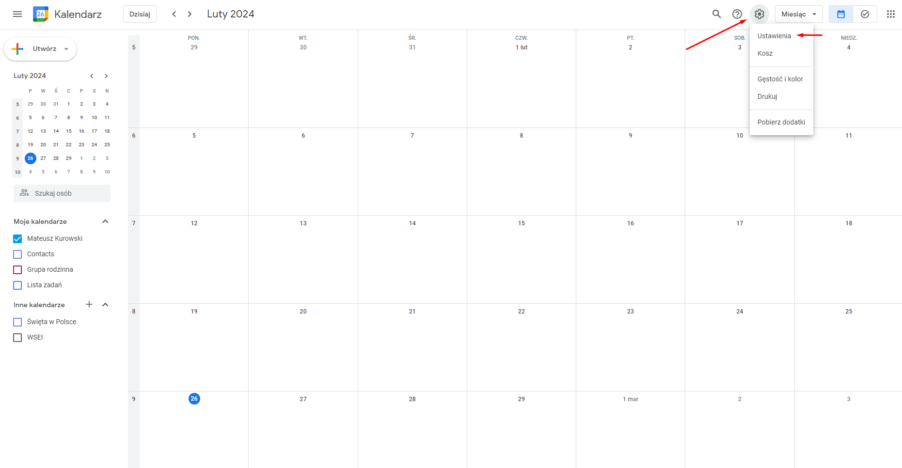
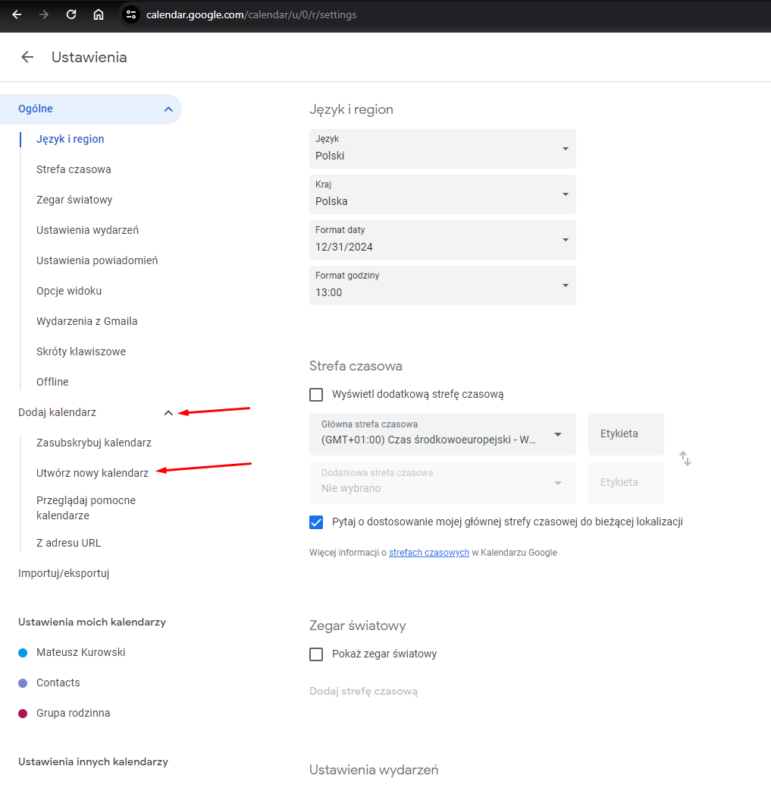
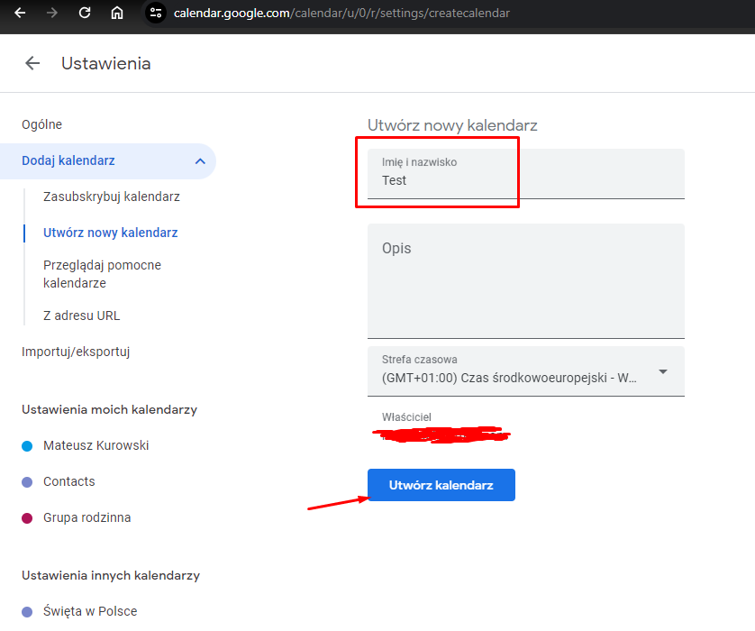
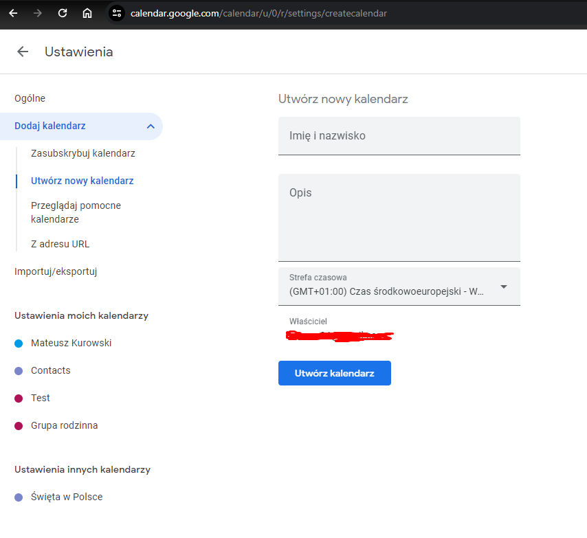

# Grafik Gigantów

## Opis

Projekt ma na celu automatyzację pobierania harmonogramu zajęć, umożliwiając szybkie i proste zaimportowanie go do wybranego kalendarza. Skrypt pobiera zajęcia z określonego dnia i semestru, zapisując je do pliku CSV, który można łatwo zaimportować do wybranego kalendarza.

## Instrukcja

1. **Sprawdź instalację Node.js:**

   Upewnij się, że na komputerze zainstalowany jest Node.js. Możesz to sprawdzić, wpisując w konsoli systemowej polecenie `node -v`. Jeśli zwrócona zostanie wersja, oznacza to, że Node.js jest już zainstalowany. W przeciwnym razie pobierz go ze [strony Node.js](https://nodejs.org/en/download/current).

2. **Pobierz projekt:**

   Kliknij przycisk **<> Code**, a następnie pobierz projekt jako plik ZIP lub sklonuj repozytorium za pomocą komendy `git clone https://github.com/MateuszKurowski/grafik_gigantow.git`.

3. **Zainstaluj biblioteki:**

   Po pobraniu projektu przejdź do jego katalogu w terminalu i wykonaj polecenie `npm install`, aby zainstalować wymagane biblioteki.

4. **Skonfiguruj plik _config.json_:**

   Uzupełnij dane logowania oraz informacje dotyczące grup w pliku konfiguracyjnym _config.json_, wypełniając pola znajdujące się poniżej pola "\_comment", które zawierają komentarze z opisami do poszczególnych pól.

5. **Uruchom skrypt:**

   Po skonfigurowaniu pliku _config.json_ uruchom skrypt, wpisując w konsoli systemowej komendę `node start.js`.

6. **Automatyczne działanie skryptu:**

   Po uruchomieniu programu i załadowaniu pliku konfiguracyjnego otworzy się przeglądarka, która automatycznie przeprowadzi proces interakcji z CRM. Nie należy kliknąć nic podczas działania skryptu.

---

**Uwaga:** Występuje jeden wyjątek, czasami losowo pojawia się komunikat, jak na zrzucie poniżej. Przed logowaniem skrypt czeka domyślnie 2 sekundy zanim rozpocznie działanie. W tym czasie możemy ręcznie wyłączyć okno klikając przycisk [Cancel]. Jeśli tego nie zrobimy, skrypt zakończy się z błędem. Okno czasami pojawia się kilka razy pod rząd. Zalecamy ręczne kliknięcie przycisku [Cancel] lub uruchomienie skryptu kilka razy.

---

Po zakończeniu działania skryptu w folderze głównym pojawi się plik **_Terminarz gigantów.csv_**, który można zaimportować do wybranego kalendarza.

## Weryfikacja błędów

W przypadku napotkania błędu zostanie utworzony plik _blad.txt_ w folderze głównym z dokładnym opisem błędu oraz linią, w której wystąpił. Należy zapoznać się z tym komunikatem. Jeśli nie można rozwiązać problemu, do zgłoszenia błędu należy dołączyć powyższy plik _blad.txt_.

## Obsługiwane kalendarze

- [x] Kalendarz Google

## Przykład importu do kalendarza Google

1. Przejdź do [kalendarza Google](https://calendar.google.com/).
2. Otwórz ustawienia, klikając w koło zębate.
   
3. Rozwiń opcję _Dodaj kalendarz_ i wybierz _Utwórz nowy kalendarz_.
   
4. Wybierz nazwę dla nowego kalendarza i kliknij przycisk _Utwórz kalendarz_.
   
5. Przejdź do opcji _Importuj/eksportuj_.
   
6. Wybierz opcję _Wybierz plik z komputera_, wybierz plik **_Terminarz gigantów.csv_**, a następnie kliknij przycisk _Importuj_.
   
7. Zweryfikuj, czy wydarzenia są zgodne z CRM i czy format wydarzeń jest prawidłowy. Jeśli wszystko jest w porządku, powtórz czynność importu od kroku numer 5 i zaimportuj terminarz do swojego głównego kalendarza.
